# LunchBuddy - DevOps Akademija lastni projekt

## Opis aplikacije

LunchBuddy je spletna aplikacija, ki omogoča dogovarjanje med sodelavci v podjetju kdaj in kam bi šli na malico. Uporabnik lahko vsak dan označi kdaj ima čas in v katero restavracijo bi šel. Aplikacija prijavljenim uporabnikom prikazuje seznam restavracij, ki so bile izbrane za tekoči dan in število ljudi, ki bi šlo na to lokacijo ob določeni uri. Lokacije so označene tudi na zemljevidu. Možen je tudi pogovor med uporabniki ter dodajanje in komentiranje restavracij. 

## Tipi uporabnikov
- **Neprijavljen uporabnik** - lahko vidi osnovno stran, ne more dodajati restavracij, glasovati ali komentirati
- **Prijavljen uporabnik** - lahko uporablja stran, vidi izbiro sodelavcev, dodaja nove restavracije, klepeta z ostalimi uporabniki, oddaja komentarje
- **Administrator** - poleg pravic, ki jih ima prijavljen uporabnik lahko administrator tudi odstrani uporabnike, restavracije, komentarje

## Trenutno stanje aplikacije
- Omogočena je prijava in registracija uporabnikov
- Možno je dodajati komentarje na restavracije.
- Možno je brisati svoje komentarje, admin lahko briše vse
- Ustvarjene so vse podstrani z manjkajočimi funkcionalnostmi

## Manjkajoče funkcionalnosti
- Dodajanje novih restavracij (Google places API)
- Prikaz lokacij restavracij na zemljevid
- Možnost izbire lokacije za uporabnike
- Dodajanje sporočil v klepet

## Virtualizacija aplikacije s cloud init na AWS

- Zaženemo novo instanco EC2 na AWS Cloud in jo poimenujemo

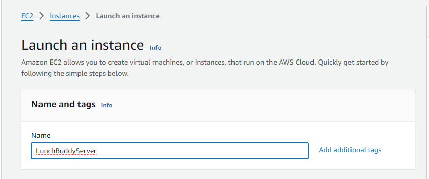

- Izberemo Ubuntu Server 22.04 LTS

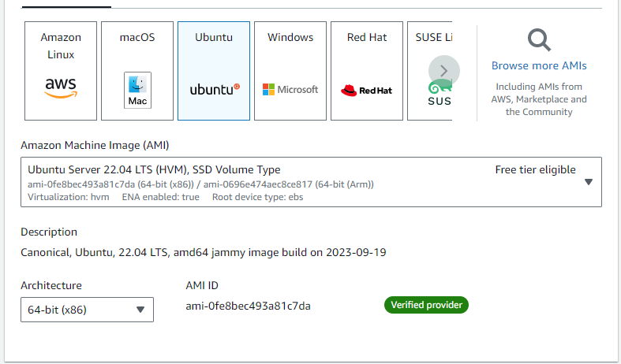

- Izberemo tip instance t3.small (2 CPU, 2GiB Memory)

- Generiramo par ključev za ssh dostop

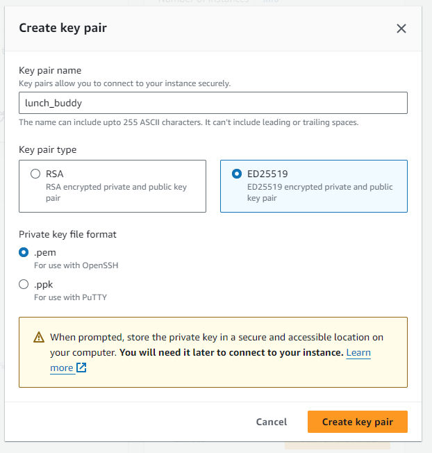

- Izberemo ključ

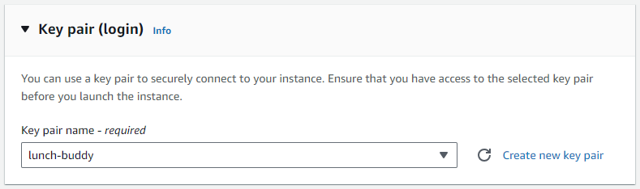

- Izberemo security group

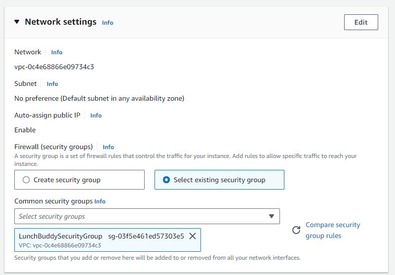

- Inbound nastavitve

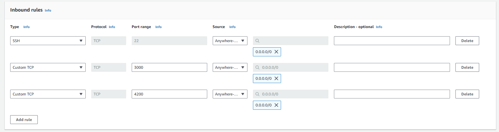

- Outbound nastavitve

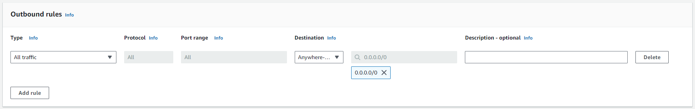

- Izberemo storage

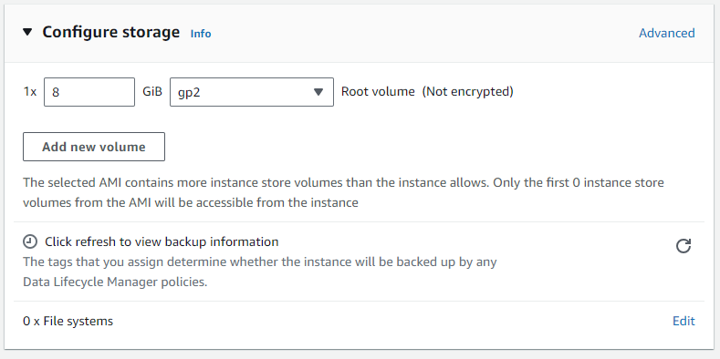

- V user data vstavimo vsebino datoteke cloud-init.yml, ki se nahaja v rootu repositorija

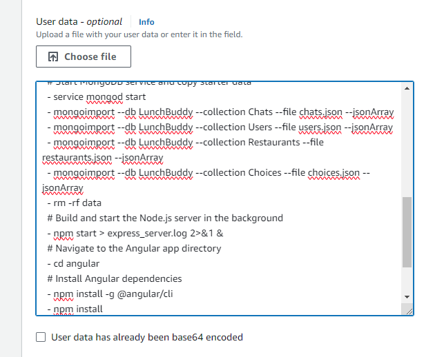

- Zaženemo virtualko
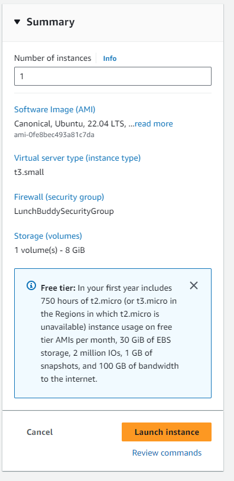

- Po zagunu vidimo lastnosti virtualke

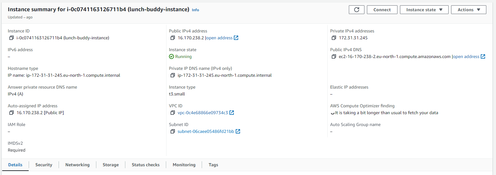

- Prek AWS se povežemo na instanco

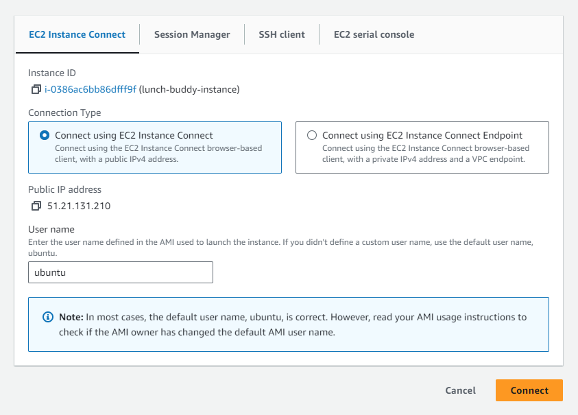

- Pogledamo cloud init log in vidimo da se je izvedel

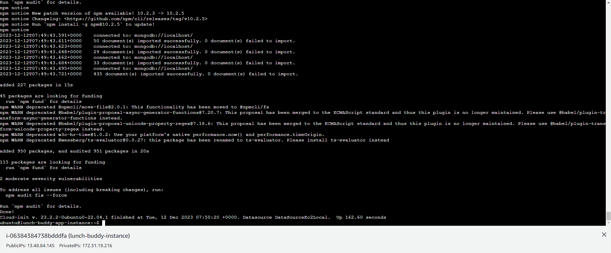

- Pogledamo log express serverja in vidimo, da se je postavil

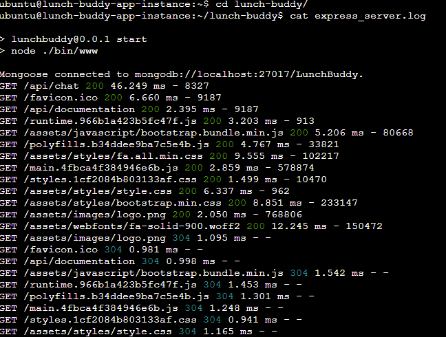

- Pogledamo log angular aplikacije in vidimo da se je uspešno zagnala

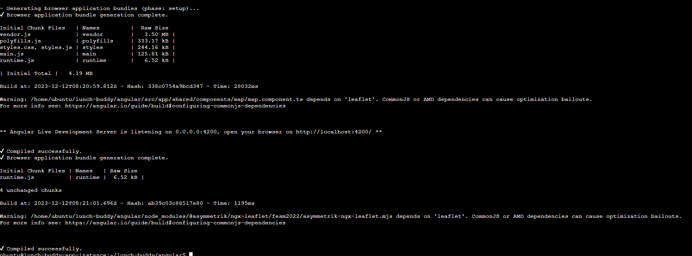

- Ustvarimo ssh tunel na ip virtualke za port 4200 in 3000

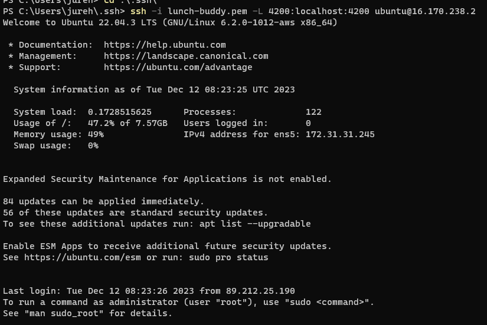

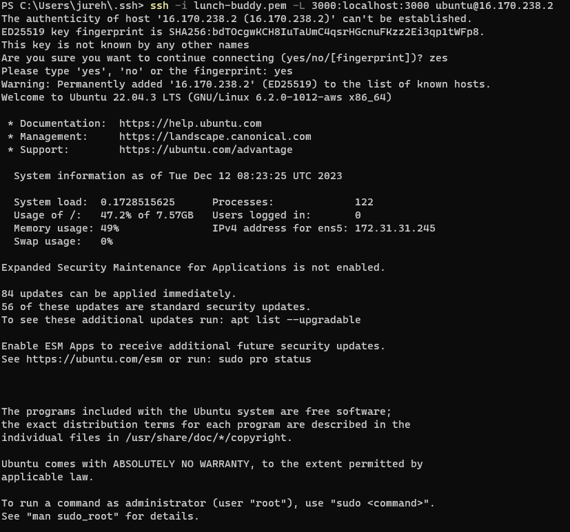

- Do API serverja dostopamo na localhost:3000

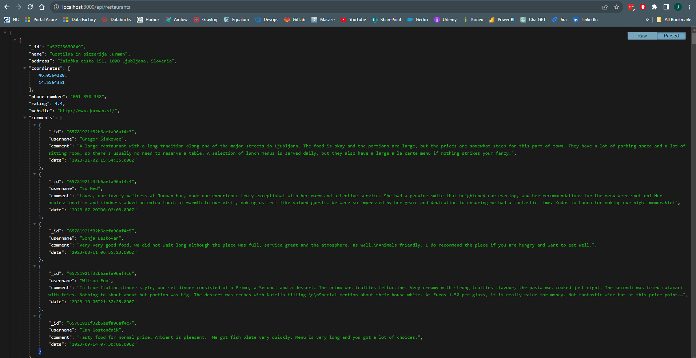

- Do angular aplikacije dostopamo na localhost:4200

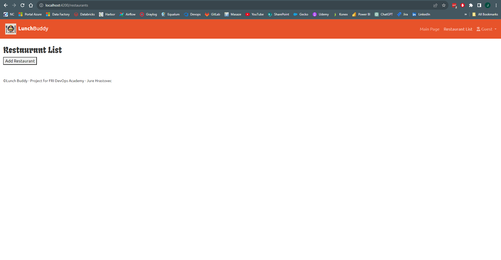

## Kaj naredi cloud-init?

- doda repositorij za mongoDB in ga namesti
- namesti nodejs
- prenese aplikacijo iz gita
- z NPM namesti vse odvisne knjižnjice, ki jih potrebujemo za API strežnik
- zažene mongo bazo in vstavi začetne podatke iz json datotek
- izbriše datoteke z začetnimi podatki
- zažene API strežnik v ozadju dostopen na localhost:3000
- namesti vse odvisne knjižnjice za Angular aplikacijo
- zažene Angular aplikacijo dostopno na localhost:4200

## Ustvarjeni uporabniki

**Administrator:**

email: admin@website.net

geslo: admin

**Prijavljen uporabnik:**

email: user@website.net

geslo: user
